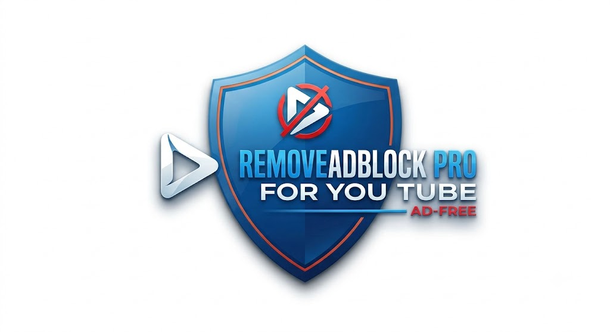

# 🛡️ **REMOVEADBLOCK PRO**  
**YouTube Ad Blocker - Version 14.9.5**

> Advanced YouTube Ad Blocker with **Stealth Injection Technology** and Intelligent Adaptive Recovery System.

---

## ✨ CORE FEATURES

- **Complete Ad Elimination**: Fully removes pre-roll, mid-roll, overlay, banner, and sponsored content
- **Enforcement Destruction**: Automatically eliminates "Continue Watching", "Ad blocker detected", and enforcement dialogs
- **Smart Auto-Skip & Acceleration**: Intelligent fast-forward and instant ad skipping
- **Emergency Stream Recovery**: Automatically restores video playback when YouTube attempts to block it
- **Hardware Interaction Protection**: Monitors real user clicks, Space, and K key presses to distinguish genuine interaction
- **High Performance**: Lightweight, does not slow down the browser
- **Adaptive Updates**: Dynamically adapts to YouTube's frequent UI changes

---

## 🧠 MULTI-LAYER ALGORITHM

The heart of **RemoveAdblock Pro** is its intelligent multi-layered defense system:

**Core Engine = (Stealth Injection + JSON Proxy) × Recovery System × Anti-Detection**

### Technology Layers:

- **Main World Injection**: Injects directly into the page's main JavaScript context (bypassing traditional content script limitations)
- **JSON Proxy Manipulation**: Deep real-time manipulation of `playerResponse` and `ytplayer.config`
- **Hardware Tracker**: Detects genuine physical user interactions
- **Network Interceptor**: Completely blocks YouTube's tracking & reporting requests
- **Nonstop Recovery Engine**: Continuous monitoring and automatic video resumption
- **Stealth CSS + DOM Observer**: Visually hides all advertising elements

---

## 🎯 KEY PROTECTION MECHANISMS

| Layer | Mechanism Name              | Description |
|-------|-----------------------------|-----------|
| 1     | **Stealth Injection**       | Direct script injection into Main World |
| 2     | **JSON Proxy**              | Real-time manipulation of player data |
| 3     | **Hardware Tracker**        | Monitors real user interactions |
| 4     | **Nonstop Recovery**        | Automatic stream recovery on interruption |
| 5     | **Anti-Detection**          | Counters YouTube's adblock detection |

---

## 📥 INSTALLATION GUIDE

1. Download the extension source code (folder or zip)
2. Open your browser (**Chrome / Edge / Brave**)
3. Go to `chrome://extensions/` or `edge://extensions/`
4. Enable **Developer Mode**
5. Click **"Load unpacked"** → Select the folder containing the extension
6. Done! The extension will activate immediately

---

## ⚙️ DEVELOPMENT & ARCHITECTURE

- **Language**: Pure JavaScript with direct injection into YouTube
- **Core Technologies**: Proxy, MutationObserver, RequestAnimationFrame, Network Interception
- **Goal**: Deliver a **clean, smooth, uninterrupted** YouTube experience

---

## 🔧 CONTACT & SUPPORT
- **Author:** Thái Thông
- **Email:** [ThaiThongsj@gmail.com](mailto:ThaiThongsj@gmail.com)

### 💰 Support the Project

**Vietcombank Account**  
`9898661918` — **NGUYỄN NGỌC THÁI THÔNG**

---

**Thank you for using RemoveAdblock Pro!**  
Enjoy YouTube without interruptions. ✨

---

**Made with ❤️ for a better viewing experience**
